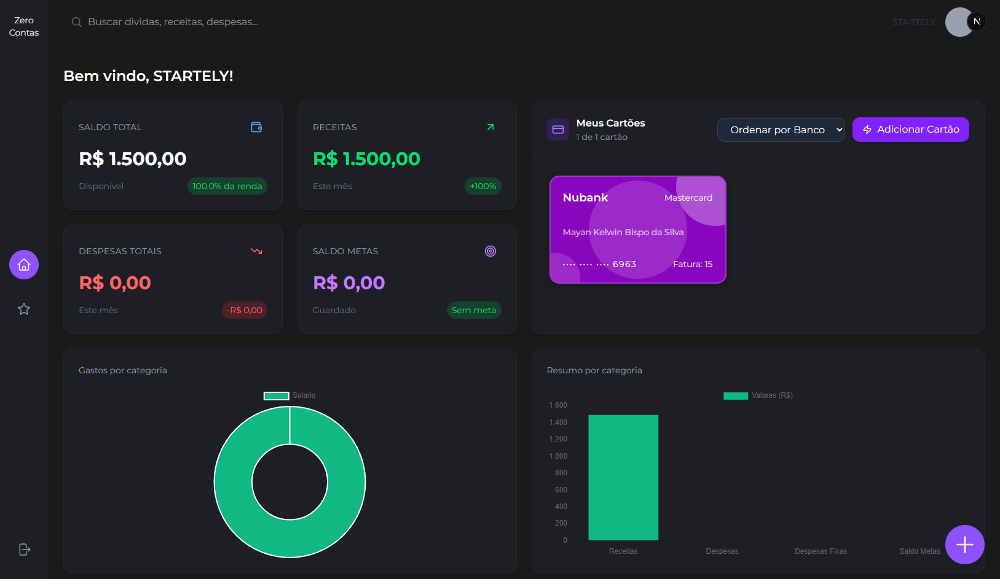
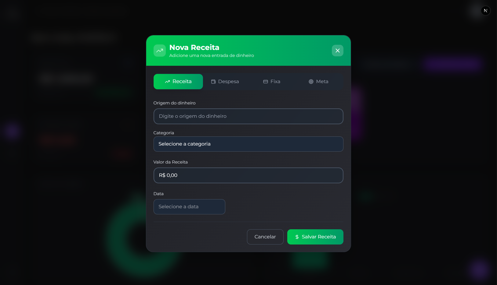
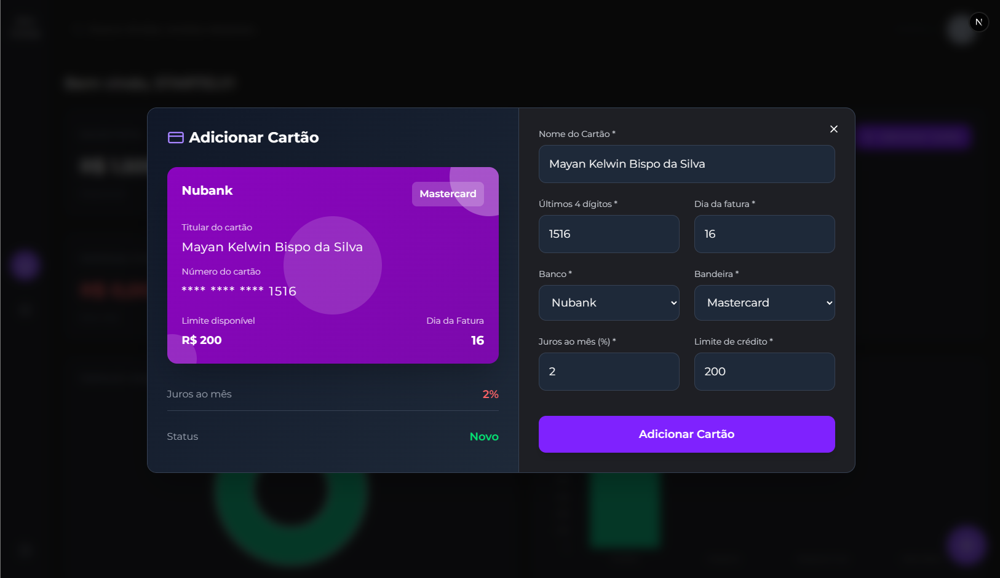
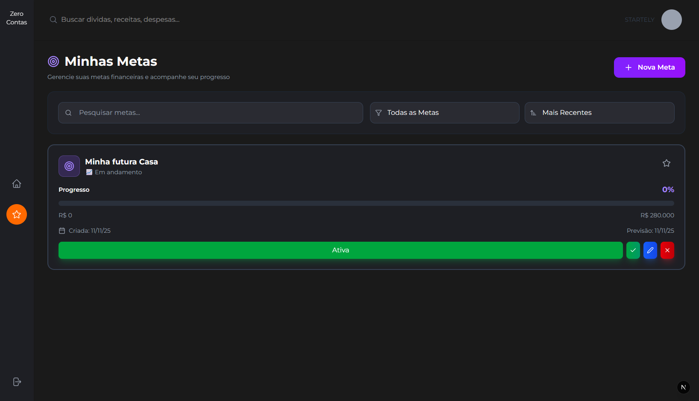
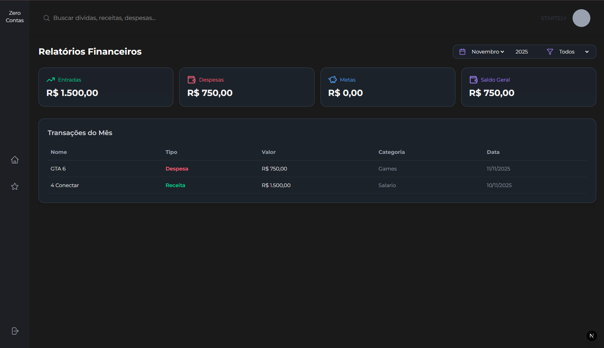

# 💸 Zero Contas — SaaS de Finanças Pessoais

> “Me ajuda a entender, organizar e prever meu dinheiro — respeitando minha realidade.”

[](https://nextjs.org/)
[](https://react.dev/)
[](https://www.typescriptlang.org/)
[](https://firebase.google.com/)
[](LICENSE)

---

## 📑 Sumário

1. [Visão Geral](#visão-geral)
2. [Preview da Aplicação](#🖼️-preview-da-aplicação)
3. [Módulos Principais](#módulos-principais)
4. [Funcionalidades Adicionais](#funcionalidades-adicionais)
5. [Estrutura de Componentes](#estrutura-de-componentes)
6. [Exemplo de Uso Real](#exemplo-de-uso-real)
7. [Como Executar o Projeto](#como-executar-o-projeto)

---

## 💡 Visão Geral

**Zero Contas** é um SaaS de **finanças pessoais** projetado para ajudar o usuário a **entender, organizar e prever o próprio dinheiro**, com foco em **simplicidade, clareza e personalização da realidade financeira de cada pessoa.**

A aplicação entrega uma visão em tempo real do orçamento pessoal, integrando:
- Despesas fixas e variáveis
- Orçamento inteligente
- Metas e objetivos
- Relatórios automáticos
- Gamificação financeira (fase futura)

---

## 🖼️ Preview da Aplicação

### 🏠 Tela Home


### 💵 Telas de Transações



### Tela de cartões de Credito


### Tela de Metas


### Tela de Relatórios



---

## 🧩 Módulos Principais

### 1. **Resumo Financeiro**
💰 Mostra o saldo atual (Receitas - Despesas)  
📈 Total de receitas e 📉 total de despesas  
📊 Gráfico de entrada e saída  
🔁 Atualização em tempo real (via Firebase listener)

---

### 2. **Despesas Fixas & Essenciais**
🧾 Cadastro de despesas fixas (pensão, aluguel, prestações, etc.)  
🔁 Recorrência mensal automática  
⚠️ Alerta de orçamento comprometido  
🧮 Cálculo de saldo livre mensal  
🔒 Marcação como essencial (não pode ser cortada)

---

### 3. **Orçamento Mensal Inteligente**
📅 Cálculo automático do valor realmente disponível  
🔸 Sugestões de categorias (lazer, alimentação, transporte, etc.)  
📊 Gráfico tipo pizza da distribuição do saldo livre  
📌 Limites por categoria  
📉 Alertas ao ultrapassar os limites

---

### 4. **Metas e Objetivos**
🎯 Criação de metas com:
- Nome, valor e prazo
- Valor mensal a poupar  
📈 Barra de progresso animada  
💡 Cálculo automático: “Se você guardar R$X/mês, chegará em X meses.”

---

### 5. **Transações & Movimentações**
✅ Receitas manuais ou automáticas  
⛔ Despesas fixas e variáveis  
🔍 Filtro por categoria, tipo, data e valor  
🧾 Histórico completo via Firebase  
📅 Visualização mensal com resumo

---

### 6. **Relatórios e Insights**
🔍 “Você gastou 35% em Lazer este mês.”  
📆 Comparativo mês a mês  
🔔 Notificações de alerta de orçamento  
🤖 Sugestões automáticas com base no comportamento financeiro

---

### 7. **Integração com Metas**
❄️ Quando o usuário guarda para uma meta, o sistema:
- Congela esse valor (não disponível para gastos)
- Atualiza automaticamente o progresso
- Registra no histórico de contribuições

---

### 8. **Gamificação e Motivação** *(fase futura)*
🏆 Conquistas por metas concluídas  
🧠 Missões financeiras (ex: “Gaste menos com delivery por 30 dias”)  
📘 Educação financeira integrada

---

## ⚙️ Funcionalidades Adicionais

| Funcionalidade | Objetivo |
|----------------|-----------|
| 🔐 **Login com Google/Firebase** | Segurança e praticidade |
| 🌙 **Modo escuro** | Conforto visual |
| 📱 **Responsividade total** | Acessível em qualquer lugar |
| 🌍 **Múltiplas moedas (futuro)** | Escalabilidade internacional |
| 🔄 **Sincronização em tempo real** | Experiência fluida e instantânea |

---

## 🧰 Como Executar o Projeto 

### Instale as dependências e rode o servidor de desenvolvimento:

```bash
# Primeiro
npm i
# Depois
npm run dev
# ou
yarn dev
# ou
pnpm dev
# ou
bun dev
